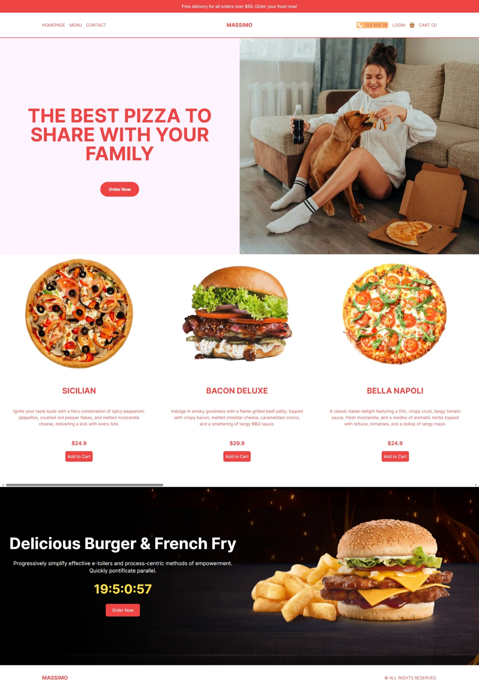
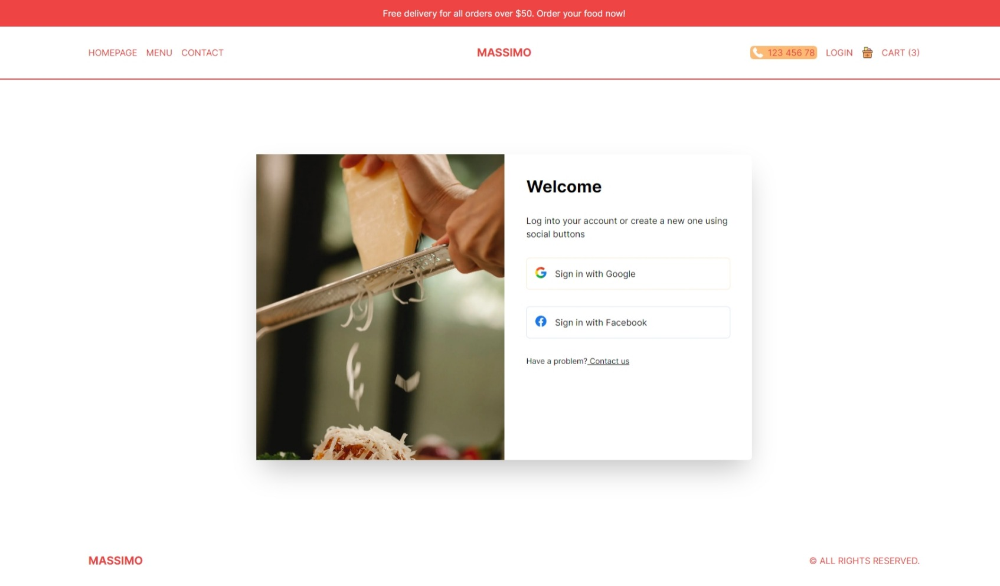
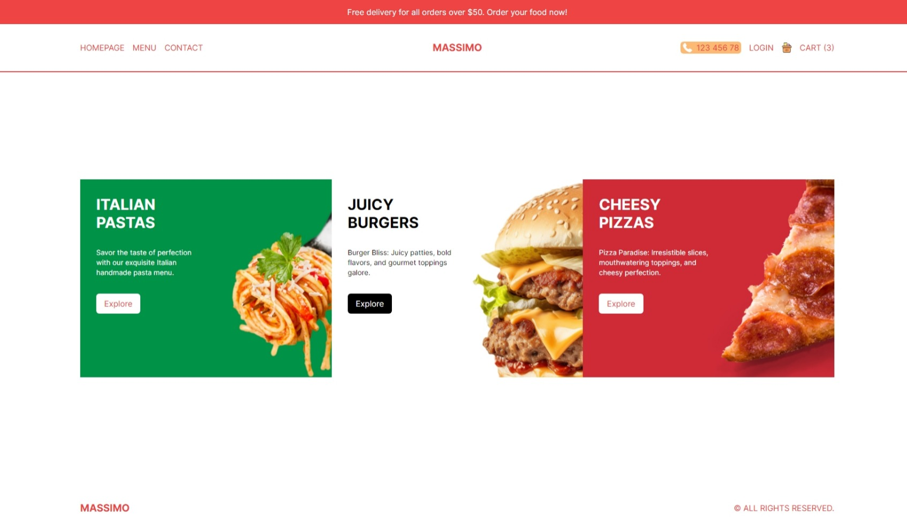
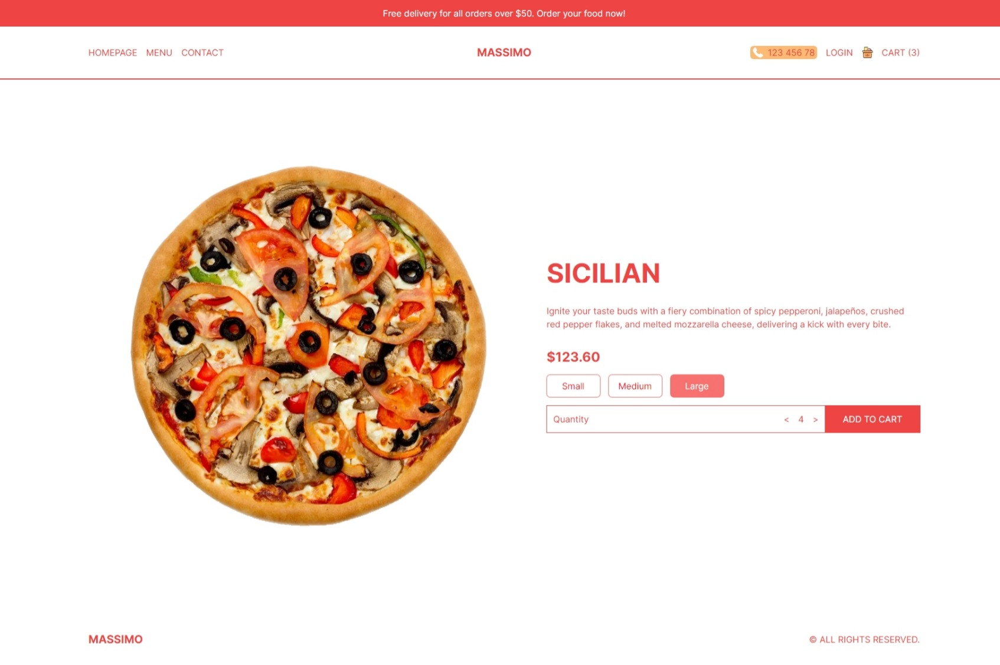

# OvenBites-NEXT

This is a full-stack ECommerce application made using NextJS and 𝗦𝗧𝗥𝗔𝗣𝗜-𝗖𝗠𝗦. All the details and configurations are mentioned in the README.md

<!-- TECH STACK BADGES -->

### :cyclone: **Pre-requisite**

- First you need to have some basic `vscode` , `node-js`
- After the installation, you need to follow the given rules below
- First you should clone the repository
  `git clone repository_link`
- After that you should open the repository folders in vscode
- First install all the **node-dependencies** by using `npm install`
- Now you are ready to run the application `npm run dev`

> _Here are some of the snapshots of the project that are listed below_
> do check it out !! Thank you for the visit

### :pushpin: **Home Page**

### :pushpin: **Login Page**

For this, NextAuth has been utilized, and all other aspects of authentication are being handled by it. Currently, **Google** and **Facebook** authentication are in use.

### :pushpin: **Product Categories Page**

### :pushpin: **Product Details Page**

### :pushpin: **Cart Page**
